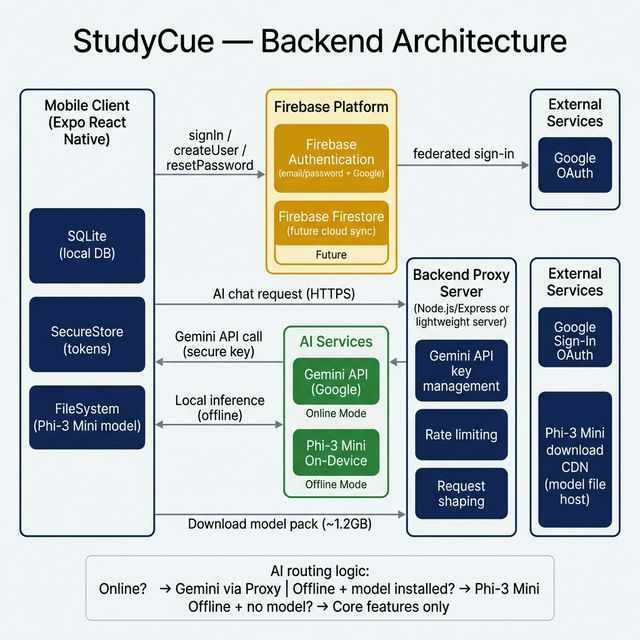
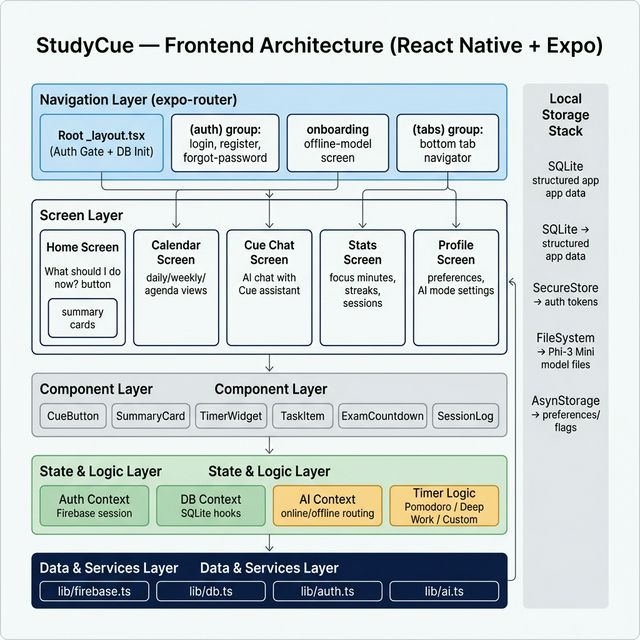

# StudyCue 📱

> **Local-first AI study planner mobile app (iOS & Android) for students who feel overwhelmed by classes, exams, and tasks.**

StudyCue helps students decide **what to do next**, plan around their class schedule, track real study time, and get AI-powered study suggestions — even without internet.

**AI Assistant:** Cue
**Stack:** React Native + Expo · Firebase Auth · SQLite · Gemini API · Phi-3 Mini (offline)

---

## Table of Contents

- [Overview](#overview)
- [Architecture](#architecture)
  - [Backend Architecture](#backend-architecture)
  - [Frontend Architecture](#frontend-architecture)
- [Tech Stack](#tech-stack)
- [Features](#features)
- [Database Schema](#database-schema)
- [Folder Structure](#folder-structure)
- [Getting Started](#getting-started)
- [Environment Variables](#environment-variables)
- [AI Behavior](#ai-behavior)
- [Security Rules](#security-rules)
- [MVP Scope](#mvp-scope)

---

## Overview

StudyCue is a **local-first** mobile app — SQLite on-device is the source of truth, not the cloud. Users can:

- Add classes, exams, and tasks manually or via natural language chat with Cue
- Get a single actionable suggestion: *"What should I do now?"*
- Run focus sessions with a built-in Pomodoro/Deep Work timer
- Track study stats (focus minutes only, not breaks)
- Use AI offline via a downloadable Phi-3 Mini model pack

---

## Architecture

### Backend Architecture



| Component | Role |
|---|---|
| **Mobile Client** | React Native + Expo. Owns SQLite, SecureStore, FileSystem |
| **Firebase Authentication** | Email/password + Google login, password reset |
| **Backend Proxy Server** | Node.js/Express — holds Gemini API key, adds rate limiting |
| **Gemini API** | Online AI for complex planning, full chat, multi-day schedules |
| **Phi-3 Mini (On-Device)** | Offline AI — quick suggestions, no internet required |
| **Google OAuth** | Federated sign-in via Firebase |
| **Phi-3 Mini CDN** | Hosts the downloadable offline model pack (~1.2 GB) |

**AI Routing Logic:**
```
Online?                  → Gemini via Backend Proxy
Offline + model ready?   → Phi-3 Mini (on-device inference)
Offline + no model?      → Core features only (no AI)
```

---

### Frontend Architecture



| Layer | Contents |
|---|---|
| **Navigation** | `expo-router` — `(auth)`, `onboarding`, `(tabs)` groups |
| **Screens** | Home, Calendar, Cue Chat, Stats, Profile |
| **Components** | CueButton, SummaryCard, TimerWidget, TaskItem, ExamCountdown, SessionLog |
| **State & Logic** | Auth Context, DB Context, AI Context, Timer Logic |
| **Data & Services** | `lib/firebase.ts`, `lib/db.ts`, `lib/auth.ts`, `lib/ai.ts` |
| **Local Storage** | SQLite (data) · SecureStore (tokens) · FileSystem (model) |

---

## Tech Stack

| Technology | Purpose |
|---|---|
| React Native + Expo | Cross-platform mobile (iOS + Android) |
| expo-router | File-based navigation |
| Firebase Authentication | User auth (email/password + Google) |
| Expo SQLite | Local-first app database |
| Expo SecureStore | Encrypted token storage |
| Expo FileSystem | Offline model file handling |
| Gemini API | Online AI — routed through backend proxy |
| Phi-3 Mini | Offline AI — downloadable on-device model |
| React Native Reanimated | Smooth UI animations |
| @expo/vector-icons | Tab bar and UI icons |

---

## Features

| # | Feature | Status |
|---|---|---|
| 1 | Email/password + Google authentication | MVP |
| 2 | User profile with study preferences | MVP |
| 3 | Class management (CRUD) | MVP |
| 4 | Exam management with countdown | MVP |
| 5 | Task & backlog management | MVP |
| 6 | AI chat with Cue (natural language) | MVP |
| 7 | "What should I do now?" button | MVP |
| 8 | Study planning engine (app logic + AI) | MVP |
| 9 | Study timer (Pomodoro / Deep Work / Custom) | MVP |
| 10 | Study statistics (focus minutes, sessions) | MVP |
| 11 | Calendar & schedule views (daily/weekly/agenda) | MVP |
| 12 | Manual edit/delete everywhere | MVP |
| 13 | Offline AI pack (Phi-3 Mini download) | MVP |
| 14 | Cloud sync across devices | Post-MVP |
| 15 | Push reminders & streaks | Post-MVP |

---

## Database Schema

All data is stored locally in **SQLite**. Tables:

| Table | Description |
|---|---|
| `users_local` | Local profile metadata (firebaseUserId, displayName, email) |
| `subjects` | Subject list with name and color |
| `classes` | Recurring class schedule (weekday, startTime, endTime, location) |
| `exams` | Upcoming exams with date, coverage, priority |
| `tasks` | Tasks with due date, estimated minutes, difficulty, status |
| `study_sessions` | Logged focus sessions (focusMinutes only, no breaks) |
| `ai_preferences` | Study style, session length, energy mode, model install status |
| `ai_suggestions` | Optional local cache of AI-generated suggestions |

> **Rule:** Passwords are never stored in SQLite. All auth lives in Firebase Auth. Only tokens go in SecureStore.

---

## Folder Structure

```
StudyCue/
├── app/                          # expo-router pages
│   ├── _layout.tsx               # Root layout — auth gate + SQLite init
│   ├── index.tsx                 # Splash / loading screen
│   ├── (auth)/
│   │   ├── _layout.tsx
│   │   ├── login.tsx
│   │   ├── register.tsx
│   │   └── forgot-password.tsx
│   ├── onboarding/
│   │   └── offline-model.tsx     # Phi-3 Mini download prompt
│   └── (tabs)/
│       ├── _layout.tsx           # Bottom tab navigator
│       ├── index.tsx             # Home screen
│       ├── calendar.tsx
│       ├── chat.tsx              # Cue AI chat
│       ├── stats.tsx
│       └── profile.tsx
│
├── components/                   # Reusable UI components
│   ├── CueButton.tsx
│   ├── SummaryCard.tsx
│   ├── TimerWidget.tsx
│   ├── TaskItem.tsx
│   ├── ExamCountdown.tsx
│   └── SessionLog.tsx
│
├── lib/                          # Core services
│   ├── firebase.ts               # Firebase app init + auth export
│   ├── db.ts                     # SQLite init + schema creation
│   ├── auth.ts                   # Auth helpers (login, register, logout)
│   └── ai.ts                     # AI routing (Gemini vs Phi-3 Mini)
│
├── docs/                         # Architecture diagrams
│   ├── backend_architecture.png
│   └── frontend_architecture.png
│
└── assets/                       # Fonts, icons, images
```

---

## Getting Started

### Prerequisites

- Node.js 18+
- Expo CLI: `npm install -g expo-cli`
- Expo Go app on your phone (for testing), or iOS/Android simulator

### Install

```bash
git clone https://github.com/your-org/studycue.git
cd studycue
npm install
```

### Run

```bash
npx expo start
```

Scan the QR code with Expo Go, or press `i` for iOS simulator / `a` for Android.

---

## Environment Variables

Create a `.env` file in the root (do **not** commit this):

```env
# Firebase config
EXPO_PUBLIC_FIREBASE_API_KEY=your_api_key
EXPO_PUBLIC_FIREBASE_AUTH_DOMAIN=your_project.firebaseapp.com
EXPO_PUBLIC_FIREBASE_PROJECT_ID=your_project_id
EXPO_PUBLIC_FIREBASE_APP_ID=your_app_id

# Backend proxy URL (your Gemini proxy server)
EXPO_PUBLIC_AI_PROXY_URL=https://your-backend-proxy.com
```

> **Do not put the raw Gemini API key in the mobile app.** The Gemini key lives only on the backend proxy server.

---

## AI Behavior

### Online — Gemini API
- Routed through your backend proxy server
- Used for: full chat, multi-day study plans, complex prioritization

### Offline — Phi-3 Mini
- Downloaded on-device via the onboarding screen
- Stored in `FileSystem` (not SecureStore — it's not a secret)
- Used for: "What should I do now?", short prompts, lightweight suggestions

### Prompt structure
The app builds a compact context from SQLite (classes, exams, tasks, preferences) and sends it with the user's message. The AI is **never** the source of truth — all data lives in SQLite.

---

## Security Rules

| Rule | Detail |
|---|---|
| ❌ Never store passwords in SQLite | Auth is Firebase-only |
| ❌ Never store passwords in SecureStore | SecureStore = tokens only |
| ❌ Never hardcode the Gemini API key | Use backend proxy |
| ✅ Firebase config values are safe to commit | But protect with Firebase Security Rules |
| ✅ Phi-3 Mini model is not a secret | It's a public downloadable file |
| ✅ Treat the mobile app as an untrusted client | All sensitive logic lives server-side |

---

## MVP Scope

### Must-have
- [x] Email/password registration and login
- [x] Google Sign-In
- [x] Password reset via Firebase
- [x] SQLite setup with all tables
- [x] Classes, Exams, Tasks CRUD
- [x] Study timer with session logging
- [x] Stats dashboard
- [x] AI chat with Cue (Gemini online)
- [x] Offline AI pack download (Phi-3 Mini)
- [x] "What should I do now?" button

### Post-MVP
- [ ] Cloud sync across devices
- [ ] Streaks and gamification
- [ ] Push notifications
- [ ] Exam readiness score
- [ ] Shared study plans
- [ ] Home screen widgets

---

## Contributing

1. Create a feature branch: `git checkout -b feature/your-feature`
2. Commit your changes: `git commit -m "feat: describe your change"`
3. Push and open a pull request to `main`

Please follow the folder structure above and keep new screens inside `app/`, services inside `lib/`, and shared UI inside `components/`.

---

*Built with ❤️ using React Native + Expo*
